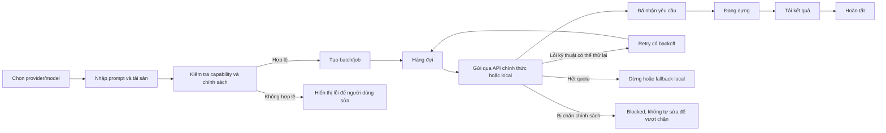

# Đặc tả nghiệp vụ hệ thống tạo video AI hàng loạt

## 1. Thông tin tài liệu

| Thuộc tính | Giá trị |
|---|---|
| Tên tài liệu | Đặc tả nghiệp vụ hệ thống tạo video AI hàng loạt |
| Phiên bản | 1.0 (Draft) |
| Ngày lập | 03/10/2026 |
| Nguồn tham chiếu | [Hướng Dẫn Sử Dụng Tool Seedance 2.5 Bản Mới Nhất Từ A-Z](https://www.youtube.com/watch?v=arfp714hFg4&t=208s) |
| Thời lượng nguồn | 08:55 |
| Phạm vi sản phẩm | Visual Loop Studio — bổ sung backend/model video AI |
| Định hướng tích hợp | API/OAuth chính thức hoặc backend local |

> Lưu ý: tài liệu được tổng hợp từ hình ảnh và phụ đề tiếng Việt tự động của video. Một số tên nút hoặc thuật ngữ có thể sai chính tả so với sản phẩm gốc. Các yêu cầu bên dưới đã được chuẩn hóa thành nghiệp vụ có thể triển khai an toàn.

Tài liệu kỹ thuật chính thức dùng để xác nhận adapter triển khai:

- [ByteDance Seed — Seedance 2.5](https://seed.bytedance.com/en/seedance2_5)
- [BytePlus LAS — Enhanced video generation API](https://docs.byteplus.com/en/docs/Byteplus_LAS/video_gen_enhanced)

## 2. Mục tiêu

Xây dựng một phân hệ cho phép người dùng tạo một hoặc nhiều video AI từ prompt và ảnh tham chiếu, theo dõi toàn bộ vòng đời job, tải kết quả về máy và tự phục hồi các lỗi kỹ thuật có thể thử lại.

Phân hệ cần:

- Hỗ trợ nhiều backend video AI thông qua giao diện provider thống nhất.
- Ưu tiên API chính thức; cho phép fallback sang AI local khi cloud hết quota hoặc không khả dụng.
- Tạo video đơn lẻ hoặc hàng loạt từ prompt/file/thư mục ảnh.
- Quản lý hàng đợi, giới hạn luồng, tiến độ, retry và kết quả đầu ra.
- Không phụ thuộc vào việc mua tài khoản, tái sử dụng cookie, xoay danh tính hoặc né cơ chế an toàn của nhà cung cấp.

## 3. Tóm tắt nội dung quan sát từ video

| Mốc thời gian | Nội dung quan sát | Quyết định nghiệp vụ |
|---|---|---|
| 00:00–00:29 | Tải, giải nén và mở công cụ | Giữ dưới dạng quy trình cài đặt Windows chuẩn |
| 00:29–03:06 | Mua proxy, mua/import nhiều tài khoản và đăng nhập hàng loạt | Chỉ ghi nhận để hiểu nguồn; loại khỏi phạm vi triển khai |
| 03:06–03:50 | Chọn model, tỉ lệ, thời lượng, chất lượng, số lượng và gửi job | Đưa vào chức năng tạo video |
| 03:50–04:39 | Theo dõi các trạng thái đang tạo, đã nhận yêu cầu, đang dựng | Chuẩn hóa thành state machine của job |
| 04:39–05:45 | Kiểm tra tài nguyên, chia nhóm/kho, chọn nhóm để chạy | Thay bằng workspace và provider profile được ủy quyền |
| 05:48–06:12 | Chọn thư mục lưu riêng hoặc thư mục mặc định | Đưa vào quản lý đầu ra |
| 06:12–06:45 | Chọn Seedance 2.5/2.0, ngang/dọc, thời lượng, ảnh tham chiếu | Đưa vào cấu hình theo capability của model |
| 06:45–07:52 | Tự mua tài khoản và tự đăng nhập | Loại khỏi phạm vi triển khai |
| 07:52–08:39 | Retry job; dùng AI tối ưu prompt sau một số lần lỗi | Chỉ cho sửa lỗi định dạng/độ rõ, không né kiểm duyệt |
| 08:39–08:55 | Xem video hoàn tất và giới hạn thời lượng theo model | Đưa vào kết quả và luật capability |

## 4. Nguyên tắc tuân thủ bắt buộc

Hệ thống không được triển khai các chức năng sau:

- Mua, bán, tạo hoặc tự động bổ sung tài khoản clone.
- Thu thập, nhập, xuất hoặc tái sử dụng cookie/session đăng nhập của bên thứ ba.
- Tự động đăng nhập hàng loạt Gmail, Facebook hoặc tài khoản mạng xã hội.
- Xoay proxy, fingerprint, thiết bị hoặc danh tính nhằm vượt quota/rate limit.
- Vượt CAPTCHA, cơ chế chống bot hoặc xác minh của nhà cung cấp.
- Sửa prompt, ảnh hoặc metadata nhằm vượt bộ lọc an toàn/nội dung.
- Gọi private endpoint hoặc mô phỏng web client khi chưa có sự cho phép của nhà cung cấp.

Các phương thức kết nối được chấp nhận:

- API key chính thức của người dùng hoặc tổ chức.
- OAuth do nhà cung cấp công bố và cho phép.
- Tài khoản dịch vụ/project cloud được ủy quyền hợp lệ.
- Backend local như ComfyUI, Wan, LTX-Video hoặc Hunyuan.
- Web automation chỉ khi nhà cung cấp cho phép rõ ràng và không dùng để né quota hay kiểm soát truy cập.

## 5. Tác nhân nghiệp vụ

| Tác nhân | Trách nhiệm |
|---|---|
| Quản trị viên | Cấu hình provider, thông tin xác thực, giới hạn chi phí và chính sách dữ liệu |
| Người vận hành | Chuẩn bị prompt/ảnh, tạo batch, giám sát job và nhận kết quả |
| Provider cloud | Nhận yêu cầu hợp lệ, xử lý job và trả trạng thái/kết quả |
| Backend local | Tạo video trên máy người dùng mà không dùng quota cloud |
| Prompt assistant | Kiểm tra và cải thiện độ rõ/định dạng prompt trong giới hạn an toàn |

## 6. Phạm vi

### 6.1. Trong phạm vi

- Cấu hình backend/model video AI.
- Tạo video từ text và/hoặc ảnh tham chiếu.
- Nhập prompt đơn, danh sách prompt và thư mục ảnh.
- Chọn model, thời lượng, tỉ lệ, độ phân giải/chất lượng và số lượng đầu ra.
- Hàng đợi nhiều job với giới hạn luồng.
- Theo dõi tiến độ và trạng thái từng job.
- Hủy, retry lỗi kỹ thuật và tiếp tục batch sau khi khởi động lại.
- Tải/lưu video vào thư mục mặc định hoặc thư mục tùy chọn.
- Nhật ký vận hành, lỗi và chi phí/quota quan sát được.
- Fallback sang backend local theo cấu hình của người dùng.

### 6.2. Ngoài phạm vi

- Kho tài khoản mạng xã hội hoặc tài khoản mua ngoài.
- Luân chuyển danh tính để sử dụng ưu đãi/lượt miễn phí nhiều lần.
- Quản lý cookie, session, OTP hoặc mật khẩu của dịch vụ bên thứ ba.
- Proxy rotation để tránh rate limit/quota.
- Tự động mua tài khoản hoặc proxy.
- Né kiểm duyệt nội dung, xác minh khuôn mặt hoặc chính sách provider.
- Cam kết loại bỏ watermark trái với quyền sử dụng của provider.

## 7. Quy trình nghiệp vụ tổng quát

## 8. Yêu cầu chức năng

### 8.1. Provider và model

| Mã | Yêu cầu |
|---|---|
| FR-PRO-001 | Hệ thống phải có giao diện provider thống nhất cho cloud và local. |
| FR-PRO-002 | Mỗi provider phải khai báo danh sách model cùng capability: input, duration, aspect ratio, resolution, audio và số ảnh tham chiếu. |
| FR-PRO-003 | Người dùng phải cấu hình credential bằng API key/OAuth chính thức. |
| FR-PRO-004 | Hệ thống phải có thao tác kiểm tra kết nối mà không tạo job tính phí. |
| FR-PRO-005 | Hệ thống phải hiển thị provider/model đang dùng trên từng job. |
| FR-PRO-006 | Khi provider trả `429` hoặc hết quota, hệ thống phải tuân theo `Retry-After`, dừng batch hoặc fallback local; không đổi danh tính để tiếp tục. |
| FR-PRO-007 | Dola/Seedance chỉ được bật khi có API/OAuth được phép và tài liệu endpoint tương ứng. |
| FR-PRO-008 | Một workspace chỉ có một credential đang hoạt động cho mỗi provider; thay đổi credential là thao tác quản trị có ghi audit. |

### 8.2. Chuẩn bị đầu vào

| Mã | Yêu cầu |
|---|---|
| FR-IN-001 | Cho phép nhập một prompt trực tiếp. |
| FR-IN-002 | Cho phép nhập danh sách prompt từ TXT hoặc CSV theo mẫu được công bố. |
| FR-IN-003 | Cho phép chọn một ảnh hoặc quét thư mục ảnh, có tùy chọn đệ quy. |
| FR-IN-004 | Cho phép gắn ảnh tham chiếu theo giới hạn của model. |
| FR-IN-005 | Cho phép khai báo số video cần tạo cho mỗi prompt/tài sản. |
| FR-IN-006 | Kiểm tra file tồn tại, định dạng, dung lượng, kích thước và quyền sử dụng trước khi xếp job. |
| FR-IN-007 | Cảnh báo và yêu cầu xác nhận quyền sử dụng khi ảnh có người thật. |
| FR-IN-008 | Hiển thị tổng số job dự kiến trước khi chạy batch. |

### 8.3. Cấu hình tạo video

| Mã | Yêu cầu |
|---|---|
| FR-GEN-001 | Cho phép chọn model từ danh sách capability của provider. |
| FR-GEN-002 | Cho phép chọn tỉ lệ tối thiểu gồm ngang `16:9` và dọc `9:16` khi model hỗ trợ. |
| FR-GEN-003 | Chỉ hiển thị các thời lượng mà model thực sự hỗ trợ. |
| FR-GEN-004 | Cho phép chọn chế độ chất lượng/tốc độ nếu provider cung cấp. |
| FR-GEN-005 | Cho phép cấu hình số luồng nhưng không vượt giới hạn provider và cấu hình an toàn của ứng dụng. |
| FR-GEN-006 | Hiển thị ước tính số job, thời gian và chi phí trước khi gửi nếu provider cung cấp dữ liệu giá. |
| FR-GEN-007 | Cho phép tạo đơn lẻ, tạo từ nhiều prompt và tạo từ thư mục tài sản. |
| FR-GEN-008 | Cho phép dừng nhận job mới và hủy các job có API hủy chính thức. |

### 8.4. Hàng đợi và vòng đời job

| Mã | Yêu cầu |
|---|---|
| FR-JOB-001 | Mỗi yêu cầu phải có mã job nội bộ duy nhất. |
| FR-JOB-002 | Lưu provider job ID để polling hoặc truy vấn lại sau khi khởi động ứng dụng. |
| FR-JOB-003 | Hiển thị trạng thái, phần trăm tiến độ, thời gian tạo, thời gian cập nhật và thông báo lỗi. |
| FR-JOB-004 | Hỗ trợ retry thủ công cho job lỗi kỹ thuật. |
| FR-JOB-005 | Retry tự động phải có exponential backoff, jitter và giới hạn số lần. |
| FR-JOB-006 | Không retry tự động đối với lỗi xác thực, hết ngân sách hoặc bị chặn chính sách. |
| FR-JOB-007 | Phải chống gửi trùng khi ứng dụng mất kết nối sau thao tác submit. |
| FR-JOB-008 | Cho phép lọc theo batch, trạng thái, model, provider và thời gian. |
| FR-JOB-009 | Cho phép xem chi tiết request đã được che bí mật và response/error đã chuẩn hóa. |
| FR-JOB-010 | Cho phép xóa bản ghi khỏi giao diện nhưng không tự xóa file đầu ra nếu chưa xác nhận riêng. |

### 8.5. Quản lý kết quả

| Mã | Yêu cầu |
|---|---|
| FR-OUT-001 | Cho phép chọn thư mục đầu ra mặc định hoặc riêng cho từng batch. |
| FR-OUT-002 | Tên file phải duy nhất và có thể truy ngược về job. |
| FR-OUT-003 | Chỉ đánh dấu hoàn tất khi file đã tải đủ, có kích thước lớn hơn 0 và có thể đọc metadata. |
| FR-OUT-004 | Tải xuống qua file tạm `.part`, sau đó đổi tên nguyên tử khi hoàn tất. |
| FR-OUT-005 | Cho phép mở file, mở thư mục và chạy lại job từ bảng kết quả. |
| FR-OUT-006 | Lưu metadata: provider, model, prompt, cấu hình, thời gian, đường dẫn và checksum. |

### 8.6. Hỗ trợ prompt

| Mã | Yêu cầu |
|---|---|
| FR-PRM-001 | Prompt assistant có thể sửa chính tả, làm rõ chủ thể/chuyển động và chuẩn hóa định dạng. |
| FR-PRM-002 | Hiển thị bản gốc, bản đề xuất và khác biệt trước khi áp dụng. |
| FR-PRM-003 | Người dùng cấu hình tối đa số lần đề xuất, mặc định 1. |
| FR-PRM-004 | Không được tự thay đổi prompt để vượt nội dung bị provider chặn. |
| FR-PRM-005 | Nếu lỗi là policy/safety, job chuyển sang `Blocked` và yêu cầu người dùng thay nội dung hợp lệ. |
| FR-PRM-006 | Không gửi prompt/tài sản sang một LLM khác nếu người dùng chưa bật và chấp thuận chính sách dữ liệu. |

### 8.7. Dashboard, nhật ký và cấu hình

| Mã | Yêu cầu |
|---|---|
| FR-OPS-001 | Dashboard hiển thị job đang chạy, chờ, hoàn tất, lỗi và bị chặn. |
| FR-OPS-002 | Hiển thị tình trạng provider/local runtime và lần kiểm tra gần nhất. |
| FR-OPS-003 | Nhật ký phải che API key, OAuth token, URL ký và dữ liệu cá nhân nhạy cảm. |
| FR-OPS-004 | Cho phép xuất báo cáo job CSV/JSON không chứa bí mật. |
| FR-OPS-005 | Cấu hình giới hạn chi phí theo ngày/batch và tự dừng khi đạt ngưỡng. |
| FR-OPS-006 | Lưu audit cho thay đổi provider, credential, ngân sách và chính sách lưu trữ. |

## 9. Trạng thái job chuẩn

| Trạng thái | Ý nghĩa | Có thể chuyển tiếp |
|---|---|---|
| `Draft` | Chưa xác nhận cấu hình | `Queued`, `Cancelled` |
| `Queued` | Đang chờ worker | `Submitting`, `Cancelled` |
| `Submitting` | Đang gửi request | `Accepted`, `RetryWaiting`, `Failed`, `Blocked` |
| `Accepted` | Provider đã nhận job | `Rendering`, `RetryWaiting`, `Failed`, `Cancelled` |
| `Rendering` | Provider đang tạo video | `Downloading`, `RetryWaiting`, `Failed`, `Blocked` |
| `Downloading` | Đang tải kết quả | `Completed`, `RetryWaiting`, `Failed` |
| `RetryWaiting` | Chờ retry theo backoff | `Queued`, `Failed`, `Cancelled` |
| `Completed` | File đầu ra hợp lệ | Trạng thái cuối |
| `Failed` | Lỗi cuối cùng sau khi hết retry hoặc lỗi không retry | Có thể retry thủ công |
| `Blocked` | Bị chặn bởi policy/safety | Không tự retry |
| `Cancelled` | Người dùng hoặc hệ thống đã hủy | Trạng thái cuối |

## 10. Quy tắc nghiệp vụ

| Mã | Quy tắc |
|---|---|
| BR-001 | Cấu hình model phải được kiểm tra bằng capability trước khi tạo job. |
| BR-002 | Duration/resolution không được tự suy đoán nếu provider không hỗ trợ. |
| BR-003 | Giới hạn luồng thực tế bằng giá trị nhỏ nhất giữa cấu hình người dùng, giới hạn provider và giới hạn hệ thống. |
| BR-004 | Một tài sản chỉ được dùng khi người vận hành có quyền sử dụng. |
| BR-005 | Lỗi policy/safety không được chuyển thành retry kỹ thuật. |
| BR-006 | Hết quota phải dừng/fallback local, không tự chuyển tài khoản hoặc credential. |
| BR-007 | Mỗi lần submit phải có idempotency key nếu provider hỗ trợ. |
| BR-008 | URL tải tạm thời phải được tải về trước hạn và không ghi đầy đủ vào log. |
| BR-009 | Credential không được lưu trực tiếp trong project hoặc file log. |
| BR-010 | Xóa job và xóa file là hai thao tác riêng biệt. |
| BR-011 | Tối ưu prompt không được giảm mức an toàn hoặc che giấu nội dung bị cấm. |
| BR-012 | Provider web không có API chính thức được đánh dấu `Unsupported` cho đến khi có quyền tích hợp. |

## 11. Mô hình dữ liệu nghiệp vụ

### 11.1. `ProviderProfile`

- `id`
- `name`
- `provider_type`
- `auth_type`
- `secret_reference` — tham chiếu tới kho bí mật, không chứa secret thô
- `enabled`
- `health_status`
- `daily_budget`
- `created_at`, `updated_at`

### 11.2. `ModelCapability`

- `provider_id`
- `model_id`
- `display_name`
- `input_modes`
- `durations`
- `aspect_ratios`
- `resolutions`
- `supports_audio`
- `max_reference_images`
- `max_concurrency`

### 11.3. `GenerationBatch`

- `id`
- `name`
- `provider_profile_id`
- `model_id`
- `default_options`
- `output_directory`
- `job_count`
- `status`
- `estimated_cost`, `actual_cost`
- `created_at`, `completed_at`

### 11.4. `GenerationJob`

- `id`, `batch_id`
- `provider_job_id`
- `status`
- `prompt_original`, `prompt_effective`
- `source_assets`
- `generation_options`
- `progress`
- `attempt_count`
- `error_code`, `error_message`
- `output_path`, `output_checksum`
- `created_at`, `updated_at`, `completed_at`

### 11.5. `AuditEvent`

- `id`
- `actor`
- `action`
- `target_type`, `target_id`
- `safe_details`
- `created_at`

## 12. Màn hình đề xuất

### 12.1. Tổng quan

- Tình trạng kết nối của từng provider/local backend.
- Số job đang chạy, chờ, hoàn tất, lỗi và bị chặn.
- Chi phí/quota quan sát được trong ngày.
- Cảnh báo hết quota, hết ngân sách hoặc backend mất kết nối.

### 12.2. Tạo video

- Chế độ tạo đơn, nhiều prompt và thư mục ảnh.
- Vùng prompt và tải file TXT/CSV.
- Khu vực ảnh tham chiếu.
- Chọn model, thời lượng, tỉ lệ, chất lượng và số lượng.
- Chọn luồng trong giới hạn cho phép.
- Nút tạo, dừng nhận job mới và hủy.
- Bảng job có preview, trạng thái, model, file, prompt và thao tác.

### 12.3. Provider và credential

- Danh sách provider profile được ủy quyền.
- Kiểm tra kết nối, chọn credential đang hoạt động và đặt ngân sách.
- Không hiển thị hoặc cho xuất secret thô.
- Không có chức năng import cookie/session hoặc mua tài khoản.

### 12.4. Cài đặt

- Thư mục đầu ra mặc định.
- Giới hạn luồng và retry.
- Chính sách lưu log/tài sản.
- Cấu hình local runtime.
- Bật/tắt prompt assistant và chính sách gửi dữ liệu.

## 13. Tiêu chí chấp nhận chính

### AC-01 — Tạo một video hợp lệ

**Given** provider đã kết nối và model hỗ trợ cấu hình đã chọn 
**When** người dùng nhập prompt, chọn ảnh tham chiếu và bấm tạo 
**Then** hệ thống tạo một job, nhận provider job ID, theo dõi đến hoàn tất và lưu file hợp lệ.

### AC-02 — Batch từ danh sách prompt

**Given** file TXT/CSV hợp lệ có `N` prompt 
**When** người dùng chọn `M` video cho mỗi prompt 
**Then** hệ thống hiển thị trước `N × M` job và chỉ xếp hàng sau khi người dùng xác nhận.

### AC-03 — Chặn cấu hình không được model hỗ trợ

**Given** model chỉ hỗ trợ một tập duration/resolution cụ thể 
**When** cấu hình nhập không tương thích 
**Then** hệ thống không gửi request và chỉ rõ trường cần sửa.

### AC-04 — Retry lỗi tạm thời

**Given** provider trả lỗi mạng hoặc `5xx` 
**When** số lần retry chưa vượt giới hạn 
**Then** job chuyển `RetryWaiting`, chờ backoff rồi thử lại mà không tạo job trùng.

### AC-05 — Hết quota

**Given** provider trả lỗi hết quota 
**When** fallback local đã bật và sẵn sàng 
**Then** hệ thống đề nghị hoặc thực hiện fallback theo cấu hình; nếu không, batch dừng có kiểm soát.

### AC-06 — Nội dung bị chặn

**Given** provider trả lỗi policy/safety 
**When** hệ thống xử lý phản hồi 
**Then** job chuyển `Blocked`, không retry và không tự sửa prompt để vượt chặn.

### AC-07 — Khôi phục sau khi đóng ứng dụng

**Given** có job cloud ở trạng thái `Accepted` hoặc `Rendering` 
**When** ứng dụng được mở lại 
**Then** hệ thống tiếp tục polling bằng provider job ID và không submit lại.

### AC-08 — Bảo vệ credential

**Given** người dùng đã lưu API key 
**When** xem settings, log, export hoặc project file 
**Then** API key không xuất hiện dưới dạng văn bản thô.

## 14. Yêu cầu phi chức năng

| Nhóm | Yêu cầu |
|---|---|
| Bảo mật | Lưu secret bằng Windows Credential Manager hoặc kho bí mật tương đương; TLS; che log; phân tách dữ liệu theo workspace |
| Tin cậy | Job cloud có thể tiếp tục sau restart; submit chống trùng; tải file nguyên tử |
| Hiệu năng | UI không bị khóa; queue xử lý nền; cập nhật tiến độ có giới hạn tần suất |
| Khả dụng | Một lỗi job không làm dừng toàn batch; có thao tác dừng/hủy rõ ràng |
| Quan sát | Log cấu trúc, correlation ID, thống kê duration, lỗi và retry |
| Riêng tư | Có thời hạn lưu prompt/tài sản/log; cho phép xóa dữ liệu cục bộ |
| Tương thích | Windows build hiện tại; đường dẫn Unicode; file dài; proxy doanh nghiệp nếu cần kết nối hợp lệ |
| Bảo trì | Adapter provider tách khỏi UI; capability không hard-code rải rác |

## 15. Ánh xạ với code hiện tại

Code hiện tại đã có ba hướng xử lý:

- `ai/veo.py`: Veo qua Gemini API.
- `ai/google_vids_web.py`: Google Vids Web Beta.
- `ai/comfyui.py` và `ai/local_runtime.py`: các model local.
- `ui/visual_creator.py`: UI và nhánh điều phối từng engine.

Đề xuất thay đổi kiến trúc:

1. Tạo `ai/providers/base.py` chứa protocol/interface chung.
2. Bọc Veo, ComfyUI và các backend hợp lệ thành adapter riêng.
3. Tạo `ai/job_manager.py` quản lý state machine, polling, retry và persistence.
4. Tách capability model khỏi widget UI.
5. Tạo adapter Seedance/Dola chỉ sau khi có tài liệu API/OAuth chính thức.
6. Chuyển API key khỏi `settings.json` sang Windows Credential Manager.
7. Dùng backend local làm phương án fallback thay vì luân chuyển tài khoản.

## 16. Phân kỳ triển khai

### Giai đoạn 1 — Nền tảng provider

- Interface provider và model capability.
- Adapter cho Veo và ComfyUI hiện có.
- Kho bí mật an toàn.
- Unit test cho capability và lỗi chuẩn hóa.

### Giai đoạn 2 — Job manager

- State machine và persistence.
- Batch queue, concurrency, polling và retry.
- Khôi phục sau restart.
- Kiểm tra file đầu ra.

### Giai đoạn 3 — UI batch

- Tạo đơn/nhiều prompt/thư mục.
- Bảng job, filter, retry, cancel và mở thư mục.
- Dashboard chi phí/quota và giới hạn ngân sách.

### Giai đoạn 4 — Provider mới

- Tích hợp Seedance/Dola qua API/OAuth được phép.
- Mapping capability theo tài liệu chính thức.
- Contract test với sandbox của provider.

## 17. Điểm cần xác nhận trước khi phát triển

- Nhà cung cấp Seedance/Dola mục tiêu và tài liệu API chính thức.
- Cơ chế xác thực được nhà cung cấp cho phép.
- Các model ID, duration, resolution và chế độ tham chiếu thực tế.
- Có webhook hay chỉ hỗ trợ polling.
- Quy tắc giá, quota và rate limit.
- Quyền hủy job và thời hạn URL tải kết quả.
- Chính sách dữ liệu đối với ảnh người thật.
- Người dùng muốn fallback local tự động hay cần xác nhận từng lần.

## 18. Definition of Done cho MVP

- Tạo được video qua ít nhất một cloud API và một local backend.
- Cùng một UI có thể chọn backend/model dựa trên capability.
- Batch hoạt động ổn định, không gửi trùng và tiếp tục được sau restart.
- Retry phân biệt đúng lỗi tạm thời, quota và policy.
- File đầu ra được xác minh và truy ngược về job.
- Credential không xuất hiện trong `settings.json`, project hoặc log.
- Không có chức năng account farm, cookie/session import, proxy rotation hoặc policy bypass.
- Có unit test cho provider contract, state transition, retry và file download.
